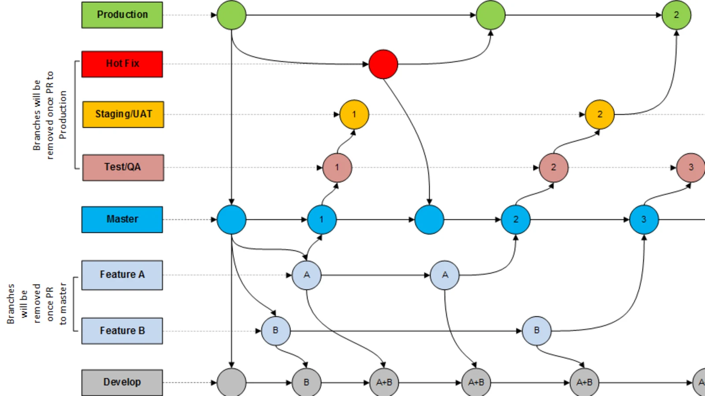

# Hotel Reservation Application

This is a Java-based Spring Boot application designed to manage the reservations for a hotel. The system is capable of handling various entities like users, reservations, rooms, sales, and traceability data.

## Dependencies

The following are the key dependencies used in this project:

- **Spring Boot Starter Data JPA**: This is used for easy access and manipulation of the application's relational data using Java Persistence API.
- **Spring Boot Starter Web**: This is used to build a web, including RESTful, applications using Spring MVC. It uses Tomcat as the default embedded container.
- **ModelMapper**: This is a simple library for object mapping. It can be used to map objects of different types, allowing for easy conversion and manipulation of data.
- **Spring Boot DevTools**: A set of tools for the development of Spring Boot applications. It allows for automatic restart, live reload, and configuration options.
- **MySQL Connector**: This is a database driver used for connecting the application with a MySQL database.
- **Lombok**: A Java library that automatically plugs into your editor and build tools, spicing up your Java with methods like getters and setters.
- **Jakarta Validation API**: This is used to apply constraints on the application's data.
- **Spring Boot Starter Test**: This provides testing capabilities for Spring Boot applications.

## Structure

The project follows a hexagonal architecture style, which separates the software application into loosely coupled components that can be easily connected to their software environment by means of ports and adapters. This makes the components exchangeable at any level and facilitates test automation.

### Key components

- **Application**: Contains DTOs (Data Transfer Objects), service classes for various entities like reservations, payments, users, etc., and strategies for operations like saving to the database, printing PDFs, etc.
- **Domain**: Contains the main business logic and entities of the application like User, Reservation, Room, etc.
- **Infrastructure**: Includes controllers for handling various HTTP requests and responses, and repositories for data access.

## How to Run

1.  You need to have Java 17 installed on your machine. You can download it [here](https://www.oracle.com/java/technologies/javase-jdk17-downloads.html).
2.  To run the application, navigate to the root directory and run the following command:

bashCopy code

`mvn spring-boot:run`

3.  By default, the application will run on port 8080. You can access it at [http://localhost:8080](http://localhost:8080).
4.  To run the tests, use the following command:

bashCopy code

`mvn test`

## Database

The application uses MySQL for database. You need to have a MySQL server running and configure the application properties accordingly.

### Docker Code 

***Download Mysql from mysql docker oficial*** 

```
docker pull mysql:latest
``` 

***Run mysql of docker***

```
docker run --name some-mysql -p 3306:3306 -e MYSQL_ROOT_PASSWORD=my-secret-pw -d mysql:latest
``` 

***Go to mysql compose ***
```
docker-compose exec db mysql -uroot -proot marthoteldb
```
***Run mysql of docker***
```
create database marthoteldb;
use marthoteldb
```

***Run App from docker ***
```
docker-compose up -d
```

##### Copy data from db.sql after copy intest from seed.sql (**show_resources**)

## Contributing

Feel free to open issues and pull requests. For major changes, please open an issue first to discuss what you would like to change.

## Swagger 

Changue the port and url if is necesary !
```
http://localhost:8080/swagger-ui/index.html
```

## License

The project is under the MIT license. For more information, please see the [LICENSE](LICENSE) file.

### Crear rama

git checkout -b feature/MINOMBREAQUIENMINUSCULA

### Subir cambios

Estando en la rama que que cree

- git add .
- git commit -m "MI mesnaje aqui"

## Git Flow



## Hexagonal


