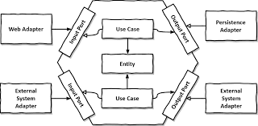

# hotelhexagonal
Final project

### Crear rama
git checkout -b feature/MINOMBREAQUIENMINUSCULA

### Subir cambios 

Estando en la rama que que cree

* git add .
* git commit -m "MI mesnaje aqui"

## Git Flow

## Hexagonal

